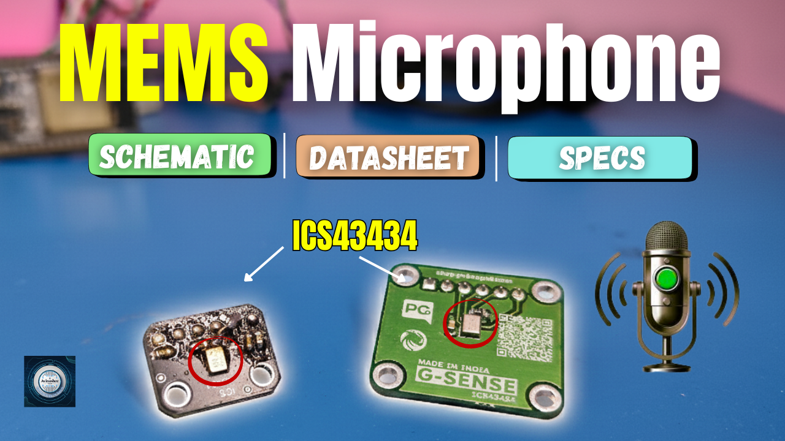
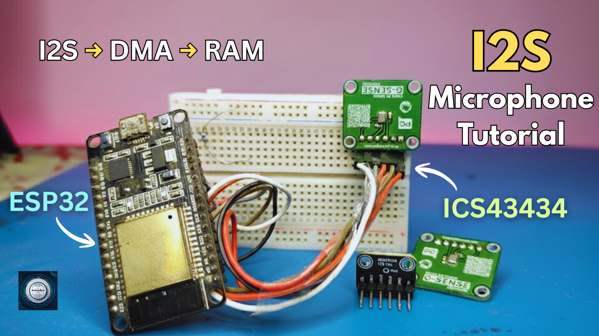
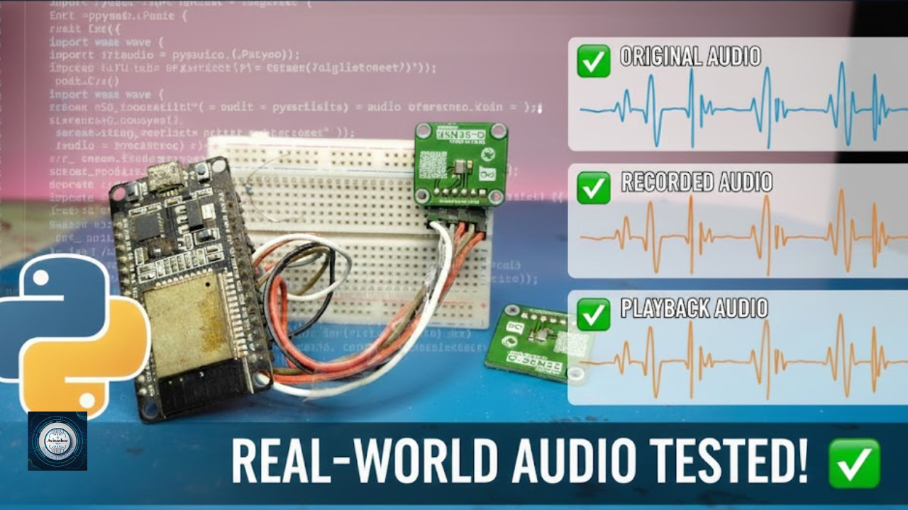

<h1 align="center">
  <a href="https://www.youtube.com/@eccentric_engineer">
	
  </a>  
</h1>

<h3 align="center">
	Real World Audio Test with ICS43434 and ESP32
</h3>


  
## 📝 Overview

This repo covers datasheet discussion, pcb schematic and pinouts of ICS43434 mems microphone. Later on we focus on 
implementation of ICS43434 with the ESP32 controller in idf environment with updated i2s drivers.  
  
The implementation focuses on basic i2s communication between the two devices and integration of a python script to further  
send those i2s bytes over uart to PC where it is saved as a .wav audio file.  

  
This .wav audio file helps us to understand the quality of audio captured by our mic and also to validate it's functionaility, do refer to our videos on YouTube.
  
Platform used for firmware development is ESP-IDF v5.0.6 on VSCode and Python 3.12.10 for audio script.  
Learn more about this series 👇👇  
  
Part 1 👇  
[](https://youtu.be/qm5UiGBVRLc)  

Part 2 👇  
[](https://youtu.be/JXZzgvJYjUo)  

Part 3 👇  
[](https://youtu.be/XXu9vCYK2z8)  
  
## ✔️ Requirements

### 📦 Hardware
- ESP32 Devkit V1 (main controller  board)
- USB Micro Cable
- ICS43434 Mems Microphone
- Jumper Cables
- USB TTL Module

### 📂 Software
- VSCode (https://code.visualstudio.com/)  
- ESP-IDF (https://docs.espressif.com/projects/vscode-esp-idf-extension/en/latest/installation.html)
- Python (https://www.python.org/downloads/)
- Audacity (https://www.audacityteam.org/)

## 🛠️ Installation and usage

```sh
git clone https://github.com/AvinasheeTech/esp32-audio-capture.git
Open project in VSCode
Go to ESP-IDF explorer icon in the left side panel -> Select Open ESP-IDF Terminal
Enter command 'idf.py set-target x' to select correct chip. Example - For ESP32 DevKit V1
replace x with esp32. for ESP32-C6 DevKitC-1, replace x with esp32c6 and so on. 
Enter the command 'idf.py build' to build the firmware.
Next connect ESP32 device to PC and confirm the COM port available.
Run the command 'idf.py -p PORT flash' where PORT is COMx with x being a number, to flash the firmware.
Connect your ics43434 mic to the i2s pins and usb ttl module to uart pins mentioned in code and video.
Open powershell, navigate to audio script directory and run the script.
Start speaking or playing any audio.......
Once recording completes, run audacity and open 'recorded_audio.wav' saved file
Enjoy...🍹
```
To learn more about how to upload code to ESP32 using VSCode, click link below 👇👇  

[](https://youtu.be/aKiBNeOgbLA)


## ⭐️ Show Your Support

If you find this helpful or interesting, please consider giving us a star on GitHub. Your support helps promote the project and lets others know that it's worth checking out. 

Thank you for your support! 🌟

[](https://github.com/AvinasheeTech/esp32-audio-capture/stargazers)
